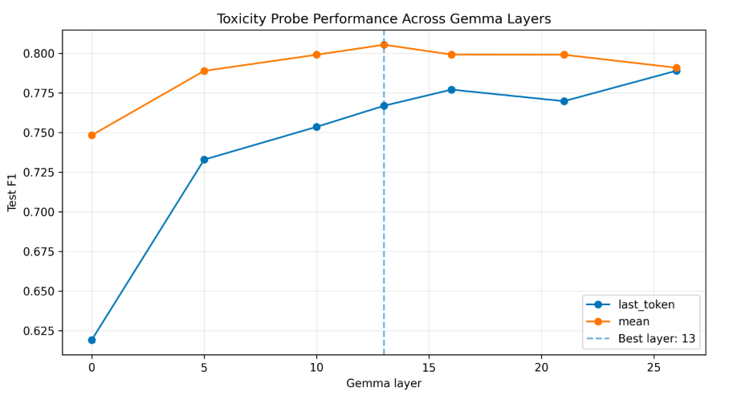
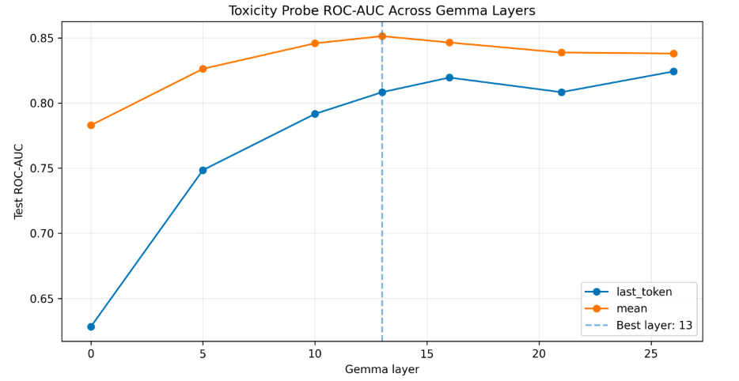
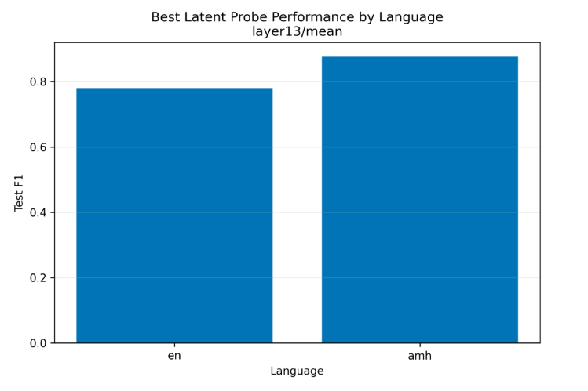
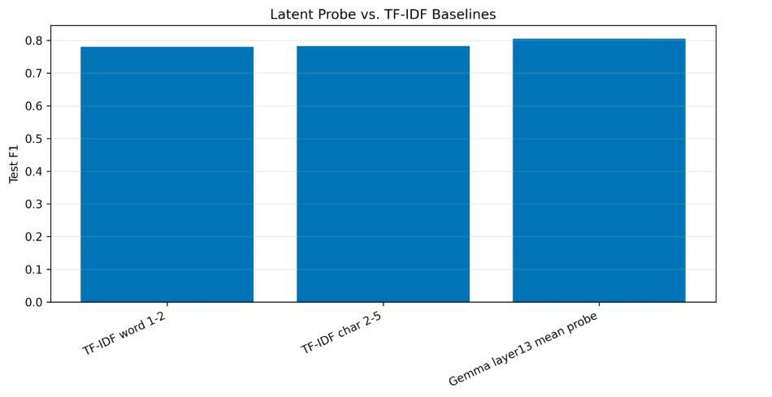
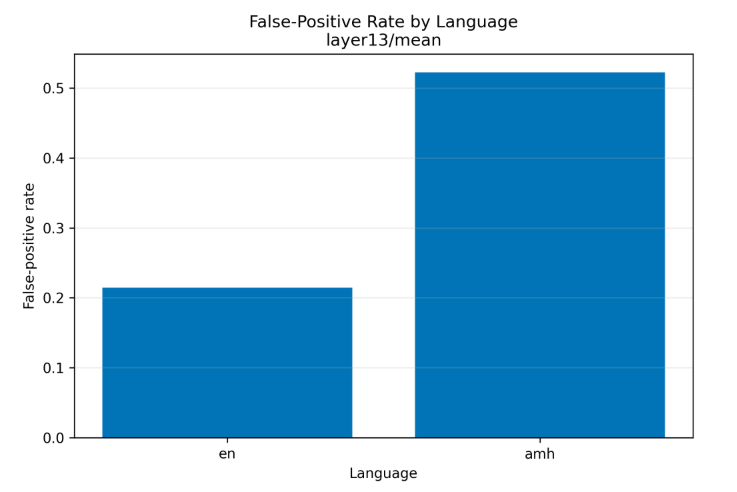

# Early Detection of Toxic Language through Latent Probing of Large Language Models

## TRI AI Saturdays — Cohort 10 | Team Hwange

This project investigates whether toxic language can be detected **before a language model generates its final output** by probing the hidden representations of a modern Large Language Model (LLM).

Rather than relying only on surface-level text classifiers or post-generation moderation, we examine where toxicity-related information becomes linearly accessible inside the model's hidden layers.

---

## 1. Problem Statement

Toxic and harmful language presents a significant challenge for modern language systems, particularly when models are deployed across multilingual and culturally diverse environments.

Conventional toxicity detection approaches generally operate on the input or generated text itself. This project explores an alternative approach:

> **Can toxicity-related information be detected from the internal hidden representations of an LLM before the model produces its final output?**

We study this question using lightweight linear probes trained on hidden-layer representations extracted from Gemma 3 1B.

The project also investigates whether these representations generalize across languages, including Amharic, and whether toxicity information becomes increasingly linearly accessible at specific model layers.

---

## 2. Research Question

**Where does toxicity information become linearly accessible within a modern Large Language Model?**

We investigate this through:

- Hidden-layer representation extraction
- Mean and last-token pooling
- Lightweight linear probes
- Layer-wise probing
- Cross-dataset evaluation
- Cross-language analysis
- Random-label and random-embedding controls

---

## 3. Model

The primary model used in this project is:

**Gemma 3 1B**

We extract hidden representations from selected transformer layers and train lightweight classifiers on these representations.

### Representation configuration

- Selected layers: 7
- Hidden representation dimension: 1,152
- Pooling strategies:
  - Mean pooling
  - Last-token pooling

The complete embedding matrix for the full dataset was approximately 2.6 GB and is **not included in this repository**.

---

## 4. Datasets

The unified dataset combines four sources:

| Dataset | Samples |
|---|---:|
| HateXplain | 19,229 |
| ToxiGen | 9,900 |
| Ubuntu Diagnostic | 9,000 |
| AfriHate | 4,958 |
| **Total** | **43,087** |

### Languages

- English: 33,629
- Amharic: 9,458

### Labels

- Toxic / Harmful: 23,737
- Safe / Non-harmful: 19,350

Ubuntu Diagnostic data is maintained separately as a zero-shot template robustness diagnostic and is not mixed into the standard training split.

---

## 5. Data Splits

The main dataset was divided into:

| Split | Samples |
|---|---:|
| Training | 27,639 |
| Validation | 2,666 |
| Test | 3,782 |
| Ubuntu Probe | 9,000 |

Leakage analysis found:

- 0 groups spanning multiple splits
- 0 identical texts spanning multiple splits

A total of 4,500 exact bilingual pairs were also validated during data quality analysis.

---

## 6. Methodology

The overall pipeline is:

```text
Raw Datasets
     │
     ▼
Dataset-Specific Loaders
     │
     ▼
Common Schema
     │
     ▼
Unified / Canonical Dataset
     │
     ▼
Train / Validation / Test Splits
     │
     ▼
Gemma 3 1B
     │
     ▼
Hidden-Layer Representations
     │
     ├── Mean Pooling
     └── Last-Token Pooling
     │
     ▼
Linear Probes
     │
     ▼
Layer-Wise Evaluation
     │
     ▼
Toxicity Detection Analysis
```

## Results

### Where does toxicity information become linearly accessible?



### ROC-AUC Across Layers



### Performance Across Languages



### Comparison with TF-IDF Baselines



### Language-Level Diagnostic


